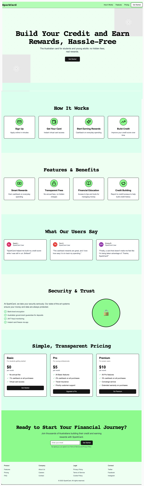

# SparkCard Landing Page - Next.js

## Assignment Overview
The goal of this assignment is to create a **responsive landing page** using Next.js with **multiple sections** while following best practices.

## Features & Requirements
▷ **Single Page Application (SPA)**
   - The landing page should be a single route (e.g., `/`).
  
▷ **Component-Based Structure**
   - Each section must be its **own component**.
   - Components **should receive content as props** from `page.tsx`.
   - You can **reuse components** where applicable.

▷ **Responsive Design**
   - The layout must be **mobile-friendly** and **adaptive**.

▷ **Customizable Theme**
   - You can modify the **color scheme**, but the **layout and structure must remain unchanged**.

▷ **Email Subscription (Bonus)**
   - The last section should include an **email input field**.
   - When submitted, the email should be **stored on the server**.
   - **Bonus:** Store the email in **MongoDB**.

▷ **Smooth Scroll Navigation**
   - Navbar buttons should be **clickable** and should scroll smoothly to the corresponding section.

▷ **Clickable Elements**
   - Buttons and links should have **clear styling** to indicate interactivity.
   - Non-functional buttons should still appear as clickable UI elements.

---

## 🎨 **Icons & Resources**
- Use icons from:
  - [Lucide](https://lucide.dev/icons/)
  - [Radix UI](https://www.radix-ui.com/)
  - Any other trusted source.

---

## 🎥 **Demo of the Final Product**
▶ **Watch the demo video here:**  

---

## 🖼️ **Final Screenshot of the Page**

